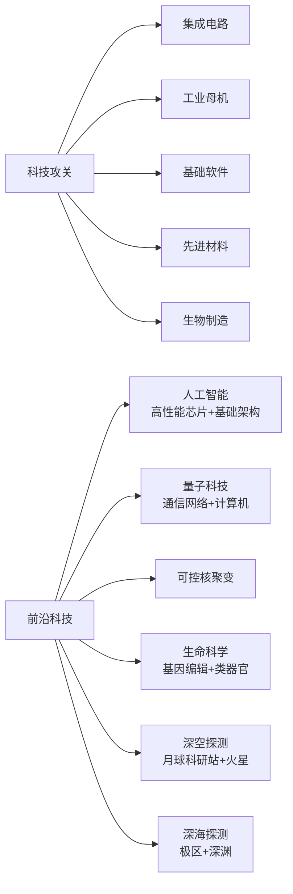
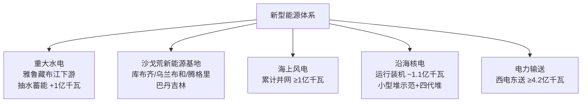
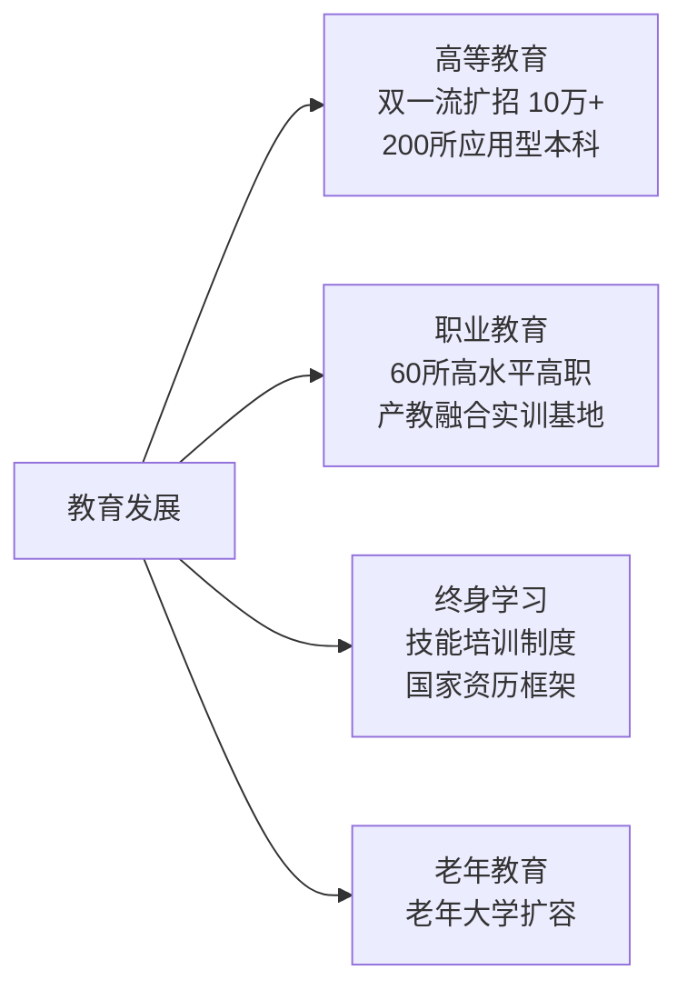
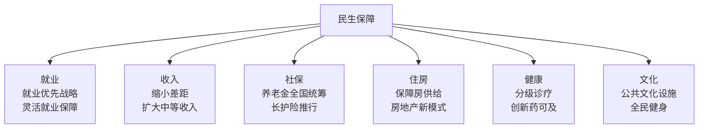

# 十五五规划深入分析 (2026-2030)

!!! info "文档来源"
    基于《中华人民共和国国民经济和社会发展第十五个五年（2026—2030年）规划纲要》(草案) 全文分析整理。

---

## 全景概览

```mermaid
graph TB
    ROOT["十五五规划 2026-2030"] --> A["现代化产业体系"]
    ROOT --> B["科技自立自强"]
    ROOT --> C["数字中国"]
    ROOT --> D["扩大内需"]
    ROOT --> E["深化改革"]
    ROOT --> F["乡村振兴"]
    ROOT --> G["区域协调"]
    ROOT --> H["文化繁荣"]
    ROOT --> I["人口发展"]
    ROOT --> J["民生保障"]
    ROOT --> K["绿色转型"]
    ROOT --> L["国家安全"]
    ROOT --> M["国防现代化"]
    ROOT --> N["对外开放"]

    A --> A1["传统产业升级"]
    A --> A2["新兴/未来产业"]
    A --> A3["现代基础设施"]

    B --> B1["集成电路/工业母机"]
    B --> B2["AI/量子/核聚变"]
    B --> B3["教育科技人才一体"]

    C --> C1["算力算法数据"]
    C --> C2["数智技术赋能"]
    C --> C3["6G/卫星互联网"]

    D --> D1["提振消费"]
    D --> D2["扩大投资"]
    D --> D3["统一大市场"]

    K --> K1["碳达峰"]
    K --> K2["环境治量"]
    K --> K3["绿色生产生活"]
```

---

## 一、国家建设重点

### 1.1 现代化产业体系

| 方向 | 关键内容 | 重点领域 |
|------|---------|---------|
| **传统产业升级** | 智能化、绿色化、融合化改造 | 钢铁、石化、建材、轻工、纺织 |
| **新兴产业壮大** | 培育世界级产业集群 | 新一代信息技术、生物制造、航空航天、新材料、新能源、高端装备 |
| **未来产业布局** | 前瞻性、颠覆性技术催生 | 量子信息、脑科学、深海深空、人形机器人、6G |
| **现代服务业** | 生产性/生活性服务业高端化 | 科技服务、金融、物流、健康、养老、文旅 |

### 1.2 科技自立自强 —— 新质生产力引擎

!!! tip "关键数字"
    - 全社会研发经费投入强度目标 > 2.8%（十四五已达 2.8%）
    - 基础研究经费占比持续提高
    - 2035 目标：人均 GDP 比 2020 年翻一番，达中等发达国家水平

### 1.3 数字中国建设

| 层级 | 内容 |
|------|------|
| **算力基础** | 东数西算、超算/通算/智算体系、全国一体化算力网 |
| **通信网络** | 5G-A 基站 50 万个、万兆光网(50G PON)端口 100 万个、6G 研发 |
| **空间信息** | 卫星互联网组网、北斗规模化应用、通导感算融合 |
| **数据设施** | 统一目录标识、数据流通利用体系、数据安全防护 |
| **低空经济** | 低空航路划设、起降及通导监气象设施、低空智能网联 |

### 1.4 新型能源体系

### 1.5 现代化基础设施

- **交通**: 铁路运营 >17万公里 (高铁 >5万)、公路 >550万公里 (高速 >21万)、民航运输机场 >300个
- **水利**: 南水北调东线二期/中线引江补汉、大型灌区现代化改造
- **城镇化**: 常住人口城镇化率 >70%、以人为本的新型城镇化

---

## 二、投资机遇分析

### 2.1 战略性新兴产业

```mermaid
graph TB
    INV["投资机遇"] --> T1["硬科技"]
    INV --> T2["新能源"]
    INV --> T3["数字经济"]
    INV --> T4["消费升级"]
    INV --> T5["基础设施"]
    INV --> T6["银发经济"]

    T1 --> T1a["集成电路全链条"]
    T1 --> T1b["AI芯片+大模型"]
    T1 --> T1c["量子计算"]
    T1 --> T1d["工业母机/高端仪器"]
    T1 --> T1e["人形机器人"]

    T2 --> T2a["光伏/风电设备"]
    T2 --> T2b["储能/抽水蓄能"]
    T2 --> T2c["核电装备"]
    T2 --> T2d["氢能/可控核聚变"]
    T2 --> T2e["新能源汽车产业链"]

    T3 --> T3a["算力中心/云服务"]
    T3 --> T3b["6G通信设备"]
    T3 --> T3c["卫星互联网"]
    T3 --> T3d["低空经济/eVTOL"]
    T3 --> T3e["数据要素市场"]

    T4 --> T4a["健康医疗"]
    T4 --> T4b["文旅体育"]
    T4 --> T4c["智能家居"]
    T4 --> T4d["国潮品牌"]

    T5 --> T5a["特高压输电"]
    T5 --> T5b["水利工程"]
    T5 --> T5c["交通枢纽"]
    T5 --> T5d["新基建REITs"]

    T6 --> T6a["养老服务"]
    T6 --> T6b["适老化改造"]
    T6 --> T6c["康复护理"]
    T6 --> T6d["银发消费品"]
```

### 2.2 重点投资方向详解

!!! success "确定性最强的赛道"

    **1. 人工智能全栈** — 高性能芯片、基础软件栈、大模型架构、行业应用

    **2. 新能源基建** — 沙戈荒基地、海上风电、核电、特高压输送通道

    **3. 低空经济** — eVTOL、低空基础设施、通信导航监视系统

    **4. 卫星互联网** — 星座建设、地面终端、通导遥一体化服务

    **5. 生物制造** — 基因编辑、合成生物、创新药、中医药现代化

!!! warning "政策催化型机遇"

    - **REITs** — 基础设施领域常态化推荐发行
    - **消费税改革** — 征收环节后移下划地方，利好消费产业
    - **数字人民币** — 稳步发展，跨境支付体系建设
    - **碳市场** — 碳排放权交易扩容，绿色金融
    - **数据要素** — 数据确权、流通、交易制度建设

---

## 三、个人发展机遇

### 3.1 高需求人才方向

| 领域 | 具体方向 | 规划信号 |
|------|---------|---------|
| **AI/算力** | AI 工程师、芯片设计、算法研究 | "研制高性能AI芯片"、"加快模型基础架构探索创新" |
| **新能源** | 光伏/风电工程师、核电技术人员 | 核电 1.1 亿千瓦、海风 1 亿千瓦 |
| **航空航天** | 卫星通信、低空经济、无人机 | "加快低轨卫星互联网组网"、低空基础设施 |
| **生物医药** | 创新药研发、基因编辑、中医药 | "攻关人工生命体系合成、类器官" |
| **数据科学** | 数据工程、隐私计算、区块链 | "国家区块链网络建设工程" |
| **绿色技术** | 碳管理、环保工程 | "积极稳妥推进碳达峰" |
| **职业教育** | 技能培训、工程师 | "新八级工"制度、国家卓越工程师学院 |

### 3.2 教育与技能提升

### 3.3 就业与创业

- **就业优先战略**: 高校毕业生、农民工、退役军人等重点群体就业支持
- **灵活就业**: 新就业形态权益保障制度完善
- **创业支持**: 创业带动就业效应
- **技能工人**: "新八级工"职业技能等级制度，技能人才上升通道打通

---

## 四、社会影响

### 4.1 人口与家庭

| 议题 | 政策方向 |
|------|---------|
| **生育友好** | 建设生育友好型社会，普惠托育扩容提质 |
| **老龄化应对** | 渐进式延迟退休、银发经济、长期护理保险 |
| **住房** | 推动房地产高质量发展，保障性住房供给 |
| **收入分配** | 提高直接税比重、完善个税制度、扩大中等收入群体 |

### 4.2 民生保障图谱

### 4.3 绿色生活转型

- **碳达峰路径**: 非化石能源消费占比持续提升
- **环境改善**: PM2.5 继续下降、地表水 III 类以上 >90%
- **绿色消费**: 阶梯水电气价、绿色产品消费激励
- **生态保护**: 森林覆盖率提升、生物多样性保护

### 4.4 数智社会

- **智慧城市**: 交通、能源、水利基础设施数智化升级
- **数字政务**: 涉老高频事项便捷办理
- **远程医疗**: 全民健康数智化建设、检验检查结果共享
- **数字教育**: 教育信息化、在线学习资源均等化

---

## 五、核心指标速览

| 指标 | 十四五成就 | 十五五方向 |
|------|-----------|-----------|
| GDP | 突破 140 万亿元 | 合理区间增长, 2035年人均翻番 |
| 研发投入强度 | 2.8% | 持续提升 |
| 城镇化率 | — | >70% |
| 铁路里程 | — | >17 万公里 (高铁>5万) |
| 核电装机 | — | ~1.1 亿千瓦 |
| 海上风电 | — | ≥1 亿千瓦 |
| 抽水蓄能 | — | 新增 ~1 亿千瓦 |
| 常规慢性病早死率 | — | <13% |
| 人均预期寿命 | >79 岁 | 持续提升 |
| 森林覆盖率 | >25% | 持续提升 |

---

## 六、Nano Banano 生图提示词

以下是基于规划核心内容生成的中文图像提示词，可直接在 Nano Banano 上使用:

---

### 提示词 1: 全景总览图 — "中国2030愿景"

> **提示词:**
> 一幅宏大的全景分层插画，展现中国2030年的发展蓝图。画面从下到上分为多层：最底层是戈壁沙漠上延绵的光伏板阵列和白色风力发电机组，金色沙丘映着夕阳；中间层是璀璨的智慧城市，矗立着6G信号塔，无人驾驶汽车和人形机器人穿行其间，高架上飞驰着银色子弹头高铁；上层是环绕地球的卫星群、散发蓝色冷光的量子计算机、以及辐射温暖能量的核聚变装置；最顶端是星空中的中国空间站和月球科研基地。配色：深海蓝、电光青、暖金色、翡翠绿。等距透视，超精细，矢量风格配渐变质感，未来感与现实感并存。 --ar 16:9

---

### 提示词 2: 科技自立自强 — "新质生产力"

> **提示词:**
> 一座未来科技枢纽，象征中国新质生产力。画面中央是一枚巨大的发光AI芯片悬浮在张开的手掌上方，周围环绕着全息投影图标：量子纠缠粒子组成的量子计算机、被金色光束编辑的DNA双螺旋、等离子环包裹的紧凑型核聚变反应堆、正在迈步前行的人形机器人、反射彩虹光芒的集成电路晶圆。背景是深蓝与青色交织的抽象神经网络图案，下方是城市天际线轮廓，5G/6G天线阵列林立。风格：电影级科幻概念艺术，体积光照明，戏剧性景深，超写实细节。 --ar 3:2

---

### 提示词 3: 新能源基建 — "绿色能源革命"

> **提示词:**
> 壮丽的航拍视角，展现中国绿色能源革命的全景画卷：戈壁荒漠上一望无际的光伏阵列和风机群在绚烂晚霞下延伸，碧蓝海面上矗立着海上风电机组，现代核电站冷却塔只排放洁白蒸汽，特高压输电铁塔跨越崇山峻岭将西部电力输送东部，绿色群山间坐落着抽水蓄能电站。角落点缀：氢燃料电池和托卡马克聚变装置微光闪烁。黄金时刻光线，航拍摄影质感，暖琥珀色与冷青色的和谐搭配。 --ar 21:9

---

### 提示词 4: 数字中国 — "万物互联"

> **提示词:**
> 一幅关于2030数字中国的前瞻性插画：全息中国地图悬浮在太空中，发光数据流在城市间穿梭，低轨卫星星座在上空编织成光网，6G信号波从基站群辐射开来，无人配送飞行器和eVTOL空中出租车穿行在城市低空廊道中，大型数据中心嵌入山体发出蓝色LED光芒，区块链网络节点闪烁着绿色脉冲光，市民在街头与AR增强现实界面互动。风格：赛博朋克与清洁科技融合美学，霓虹蓝与薄荷绿色调，等距3D渲染。 --ar 16:9

---

### 提示词 5: 民生与社会 — "人民美好生活"

> **提示词:**
> 一幅温暖而充满希望的插画，描绘2030年中国人的幸福生活：多代同堂的家庭场景中，老人在现代社区中心使用智能健康设备，父母在阳光充沛的共享办公空间用全息屏幕远程工作，孩子在充满绿植的教室里跟AI老师互动学习，一位年轻毕业生自信地走进高科技工厂。背景元素：配备远程医疗舱的现代医院、屋顶花园的保障性住房、热闹的夜市中扫码支付的场景、老人们在智慧公园里使用健身追踪设备锻炼。配色：温暖日出色调、柔和桃粉、天空蓝、自然绿。吉卜力式温馨感与现代设计融合，柔和光线。 --ar 16:9

---

### 提示词 6: 综合信息图 — "十五五规划一图读懂"

> **提示词:**
> 一张简洁现代的中国风信息图海报，标题"十五五规划一图读懂"。放射状思维导图布局，中央是金色徽标"2026-2030"。六条主分支向外延伸并配有图标：(1) 齿轮与芯片代表产业，(2) 显微镜与原子代表科技，(3) 云朵与卫星代表数字化，(4) 光伏板与风机代表绿色能源，(5) 家庭剪影代表民生保障，(6) 地球与贸易航线代表对外开放。每个分支有3-4个子项配简洁中文标签。背景是浅灰色中国地形纹理。扁平化设计，Material Design配色，专业数据可视化风格。 --ar 3:4

