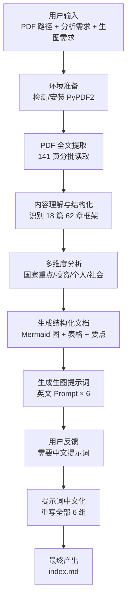
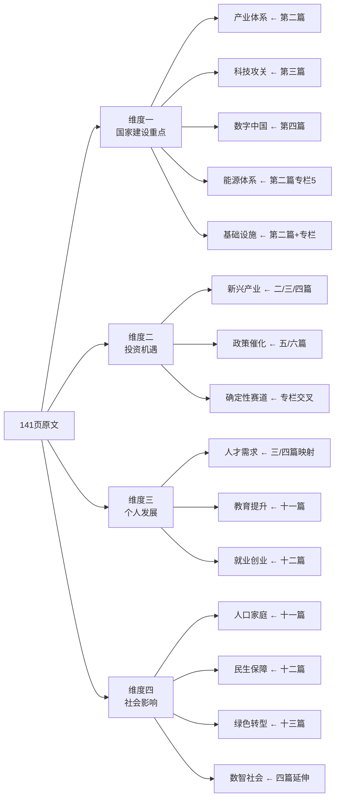

# 案例复盘：AI 辅助政策文件深度分析全流程

!!! abstract "本文定位"
    这不是分析结果本身，而是**产出那份分析结果的完整过程记录**。
    目标：让你（和任何读到此文的人）理解"给 AI 一份 PDF，最终如何变成一份结构化深度分析 + 生图提示词"背后的每一步。

---

## 端到端流程总览



---

## Step 1: 用户输入了什么

一条消息，包含三个明确需求：

| # | 需求 | 具体描述 |
|---|------|---------|
| 1 | **源文件** | `docs/assets/15th-Five-Year-Plan-Draft_NON-FINAL.pdf`（十五五规划草案） |
| 2 | **深度分析** | 国家建设重点、投资机遇、个人发展、社会影响 |
| 3 | **生图提示词** | 基于分析内容，生成可用于 Nano Banano 的 Prompt |

---

## Step 2: PDF 文本提取 —— 解决"AI 读不了 PDF"的问题

### 问题

AI 助手无法直接读取 PDF 二进制文件，`read_file` 工具对 PDF 返回错误。

### 解决方案

通过终端调用 Python PDF 解析库：

```
尝试路径：
  read_file(PDF)  → ❌ 无法读取
  ↓
  import fitz (PyMuPDF)  → ❌ 未安装
  ↓
  import PyPDF2  → ❌ 未安装
  ↓
  pip3 install PyPDF2  → ❌ PEP 668 限制
  ↓
  pip3 install --break-system-packages PyPDF2  → ✅ 成功
```

### 分批读取策略

PDF 共 141 页，单次输出受限，采用**分段提取**：

| 批次 | 页码范围 | 内容覆盖 |
|------|---------|---------|
| 第 1 批 | 1-10 | 目录、发展环境、指导方针、主要目标 |
| 第 2 批 | 11-30 | 产业体系、科技攻关、数字中国、能源/水利/新基建 |
| 第 3 批 | 31-60 | 科技前沿、内需、改革、开放、农业、区域 |
| 第 4 批 | 61-100 | 文化、人口、教育、健康、民生、绿色转型 |
| 第 5 批 | 101-141 | 安全、国防、民主法治、港澳台、规划实施保障 |

每批通过 `run_in_terminal` 执行 Python 脚本，截取每页前 1000-2000 字符，确保覆盖全文关键内容。

---

## Step 3: 内容理解与结构化

### 从 PDF 文本中识别出的文档骨架

141 页内容被解析为 **18 篇 62 章** 的清晰结构：

```
第一篇   开创中国式现代化新局面（总纲）
第二篇   现代化产业体系
第三篇   科技自立自强 → 新质生产力
第四篇   数字中国
第五篇   扩大内需
第六篇   深化改革
第七篇   对外开放
第八篇   乡村振兴
第九篇   区域协调
第十篇   文化繁荣
第十一篇  人口发展
第十二篇  民生保障
第十三篇  绿色转型
第十四篇  国家安全
第十五篇  国防现代化
第十六篇  民主法治
第十七篇  一国两制
第十八篇  规划实施保障
```

### 关键数字与专栏提取

PDF 中散落着大量**专栏（共 18 个）**，包含具体工程项目和量化指标，这些是投资分析和趋势判断的核心依据：

- 专栏 5: 新型能源体系建设（核电 1.1 亿千瓦、海风 1 亿千瓦…）
- 专栏 7: 新型基础设施（算力网、卫星互联网、6G…）
- 专栏 8: 前沿科技攻关（AI、量子、核聚变、生命科学…）
- 专栏 15: 高质量教育体系（双一流扩招 10 万+…）
- 专栏 16: 健康中国建设
- 专栏 17: 一老一小服务优化

---

## Step 4: 多维度分析框架

基于用户提出的四个分析维度，将 18 篇内容重新组织：



**分析方法**：不是简单摘抄，而是：

1. **跨篇归纳** — 如"投资机遇"需要综合产业篇、科技篇、能源专栏、改革篇等多处信息
2. **数字锚定** — 提取所有量化指标（1.1 亿千瓦、50 万基站、17 万公里铁路…）作为判断依据
3. **信号推理** — 从政策语言中提炼投资信号（如"常态化推荐发行 REITs"→基建投资机遇）

---

## Step 5: 文档生成策略

### 选择的表达形式

| 内容类型 | 表达形式 | 原因 |
|---------|---------|------|
| 全景概览 | Mermaid 思维导图 | 快速把握 18 篇整体结构 |
| 产业/人才对照 | 表格 | 信息密集，便于比较 |
| 投资赛道 | Mermaid 树图 | 展示层级关系 |
| 确定性判断 | Admonition 高亮框 | 突出重点结论 |
| 指标数据 | 对照表 | 十四五 vs 十五五一目了然 |

### MkDocs Material 特性利用

- `!!! success` / `!!! warning` — 区分确定性强/弱的投资方向
- `!!! tip` — 标注关键数字
- `!!! info` — 标注文档来源
- Mermaid 图表 — 通过 `pymdownx.superfences` 支持直接渲染
- 表格 — 通过 `tables` 扩展支持

---

## Step 6: 生图提示词的生成与迭代

### 第一轮：英文提示词

初始生成了 6 组英文 Prompt，覆盖 6 个主题视角：

| # | 主题 | 比例 | 风格 |
|---|------|------|------|
| 1 | 中国2030愿景全景 | 16:9 | 等距未来插画 |
| 2 | 新质生产力 | 3:2 | 电影级科幻概念 |
| 3 | 绿色能源革命 | 21:9 | 航拍摄影写实 |
| 4 | 数字中国 | 16:9 | 赛博朋克+清洁科技 |
| 5 | 人民美好生活 | 16:9 | 吉卜力温暖风 |
| 6 | 一图读懂 | 3:4 | 扁平信息图 |

### 第二轮：用户反馈 → 中文化

用户明确要求**中文提示词**。全部 6 组 Prompt 重写为中文，保持：

- 相同的画面构图描述
- 相同的风格和比例参数
- 自然流畅的中文表达（非机械翻译）

---

## 关键经验总结

### 对于使用者（你）

| 要点 | 说明 |
|------|------|
| **明确输入三要素** | 源文件 + 分析维度 + 输出形式，一次性说清楚效率最高 |
| **及时反馈** | "需要中文提示词"这类反馈能让 AI 快速修正方向 |
| **PDF 作为输入** | AI 可以处理 PDF，但需要通过工具链间接提取文本 |

### 对于复用者（别人）

| 场景 | 可复用的模式 |
|------|-------------|
| **任何长文档分析** | PDF 提取 → 结构识别 → 多维归纳 → 结构化输出 |
| **政策/报告解读** | 提供分析维度（如国家/投资/个人/社会）→ AI 跨章节归纳 |
| **生图 Prompt 生成** | 先完成内容分析 → 再基于分析要点生成视觉描述 |
| **MkDocs 文档站** | 分析结果直接输出为 Mermaid + 表格 + Admonition 的 Markdown |

### 技术踩坑备忘

| 问题 | 解法 |
|------|------|
| `read_file` 不支持 PDF | 改用 `run_in_terminal` + PyPDF2 |
| `pip3 install` 被 PEP 668 阻止 | 加 `--break-system-packages` 参数 |
| 141 页 PDF 太长无法一次读取 | 分 5 批次，每批 20-40 页 |
